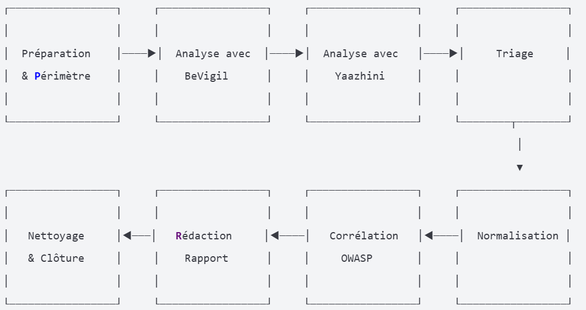

## LAB 8 : Analyse de posture et exposition d'applications mobiles avec BeVigil et Yaazhini

##  Objectifs pédagogiques
À la fin de ce lab, l'apprenant sera capable de :

Organiser un audit défensif d'application mobile
Collecter des signaux d'exposition avec BeVigil et Yaazhini
Trier les résultats et identifier les faux positifs
Corréler les constats avec les standards OWASP
Produire un rapport d'analyse exploitable

## Workflow

## Contexte et périmètre
- Application analysée : InsecureBankv2 (`com.android.insecurebankv2`) — artefact pédagogique
- Type : APK open-source à usage didactique
- Outils : BeVigil (analyse externe), Yaazhini (analyse statique/décompilation)
- But : évaluation défensive — aucune exploitation des vulnérabilités n'est réalisée

## Organisation du dépôt
- `00-scope/` : périmètre, artefact APK, métadonnées
- `01-bevigil/` : export BeVigil et notes d'analyse
- `02-yaazhini/` : rapport Yaazhini et notes
- `03-triage/` : consolidation (triage.csv) et mappage MASVS
- `04-report/` : rapport final et annexes

## Résumé des analyses
- Score externe (BeVigil) : 7.4 / 10 (niveau moyen)
- Résultats Yaazhini : plusieurs findings critiques liés au manifest, à la crypto et aux communications
- Findings consolidés : 12 (5 High, 5 Medium, 1 Low, 1 Info)

## Principales vulnérabilités identifiées
- Communications non chiffrées (MITM)
- Flags dangereux dans le manifest (`debuggable`, `allowBackup`, `exported`)
- Hachage et primitives cryptographiques obsolètes (MD5 / SHA-1)
- Composants exposés (providers / receivers)
- Usage de générateurs non sécurisés

## Priorités de remédiation
1. Corriger immédiatement les flags du manifest (impact élevé, correctifs rapides)
2. Moderniser les primitives cryptographiques et fonctions de hachage
3. Imposer TLS 1.2+ sur l'ensemble des communications et envisager le pinning

## Fichiers principaux
- [00-scope/scope.md](00-scope/scope.md)
- [01-bevigil/bevigil_notes.md](01-bevigil/bevigil_notes.md)
- [02-yaazhini/yaazhini_notes.md](02-yaazhini/yaazhini_notes.md)
- [03-triage/triage.csv](03-triage/triage.csv)
- [03-triage/owasp_mapping.md](03-triage/owasp_mapping.md)
- [04-report/rapport_final.md](04-report/rapport_final.md)
- **[analyse_personnelle.md](analyse_personnelle.md)** — Analyse critique approfondie et recommandations alternatives

## Outils et méthodes
- Analyses croisées : export automatisé (BeVigil) + décompilation et règles statiques (Yaazhini)
- Triage manuel : consolidation et normalisation des findings dans `triage.csv`

## 🔬  Analyse Critique Personnelle

Au-delà du triage standard, ce rapport inclut une **analyse personnelle approfondie** qui :
- Questionne la sévérité de chaque finding en contexte réel
- Propose une **priorisation alternative** (praticité vs CVSS)
- Identifie les **hypothèses non-validées** et découvertes secondaires
- Compare avec les standards OWASP Mobile Top 10
- Évalue l'impact métier pour différents modèles de menace

Voir [analyse_personnelle.md](analyse_personnelle.md) pour les détails.

## Troubleshooting

Problème : BeVigil ne retourne aucun résultat
Vérification : S'assurer que la cible est correctement spécifiée (nom exact de l'application ou domaine)
Solution : Essayer des variantes du nom ou utiliser l'identifiant de l'application si disponible
Alternative : Si l'application n'est pas indexée par BeVigil, documenter cette information et se concentrer sur l'analyse Yaazhini
Commande de diagnostic :
# Documenter le problème dans le log
"ISSUE: BeVigil search returned no results for [target]" | Out-File -FilePath "commands.log" -Encoding utf8 -Append
Problème : Erreur lors du parsing de l'APK par Yaazhini
Vérification : S'assurer que l'APK est valide et non corrompu
Solution : Vérifier les permissions du fichier et du dossier
Alternative : Si l'erreur persiste, essayer de redémarrer l'outil ou utiliser une version différente
Commandes de diagnostic :
# Vérifier que l'APK existe
Test-Path "00-scope\application_pedagogique.apk"

# Vérifier les permissions
Get-Acl "00-scope\application_pedagogique.apk"

# Documenter le problème dans le log
"ISSUE: Yaazhini parsing error for APK" | Out-File -FilePath "commands.log" -Encoding utf8 -Append
Problème : Trop de faux positifs dans les résultats
Vérification : Examiner chaque constat avec un regard critique
Solution : Appliquer la règle "preuve + impact + reproductibilité" pour valider les constats
Alternative : Documenter les faux positifs avec justification dans une section dédiée
Commande utile :
# Créer un fichier pour documenter les faux positifs
"# Faux positifs identifiés" | Out-File -FilePath "03-triage\faux_positifs.md" -Encoding utf8
Problème : Impossible d'exporter les résultats
Vérification : S'assurer que l'outil a terminé son analyse
Solution : Capturer des captures d'écran des résultats importants
Alternative : Documenter manuellement les constats observés avec référence à la version de l'outil
Commande utile :
# Créer un fichier pour documenter manuellement les résultats
"# Résultats manuels (export impossible)" | Out-File -FilePath "01-bevigil\manual_results.md" -Encoding utf8
Problème : Difficulté à établir la sévérité d'un constat
Vérification : Consulter les références OWASP pour des cas similaires
Solution : Évaluer l'impact potentiel dans le contexte spécifique de l'application
Alternative : En cas de doute, classer initialement comme "Medium" et justifier
Ressource utile :
Référence rapide pour l'évaluation de la sévérité:

- High: Impact direct sur la confidentialité, l'intégrité ou la disponibilité des données sensibles
- Medium: Impact indirect ou limité sur la sécurité
- Low: Impact minimal, nécessite des conditions spécifiques pour être exploité
- Info: Observation sans impact direct sur la sécurité

## Realise par :
NIAMA NAFTAOUI
